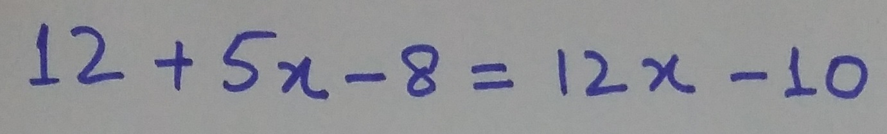
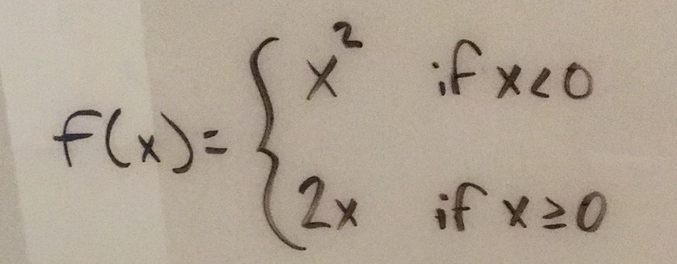
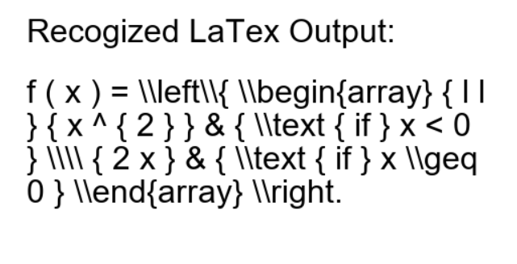
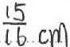
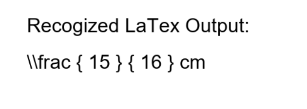

# About
This code is a Python wrapper to grab LaTex information from a local images using [Mathpix SDK](https://mathpix.com/ocr).
# Usage
## Running Environment
Python 2.7
## Examples 1
Local image:

Output image:

## Examples 2
Local image:

Output image:

## Examples 3
Local image:

Output image:

](output/cm_hw_output.PNG)
